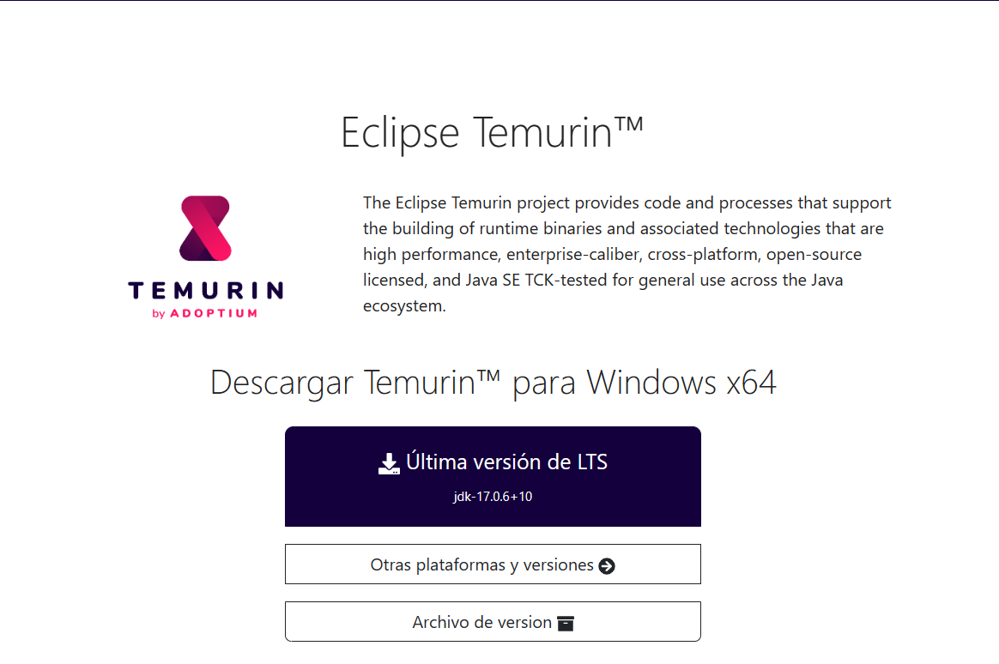
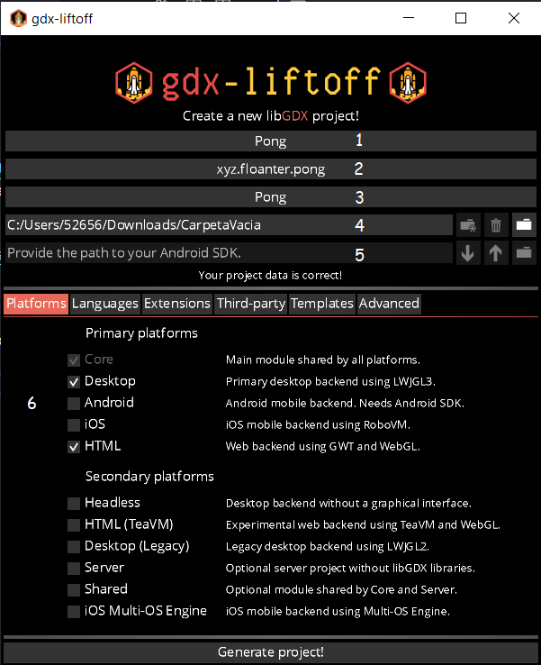
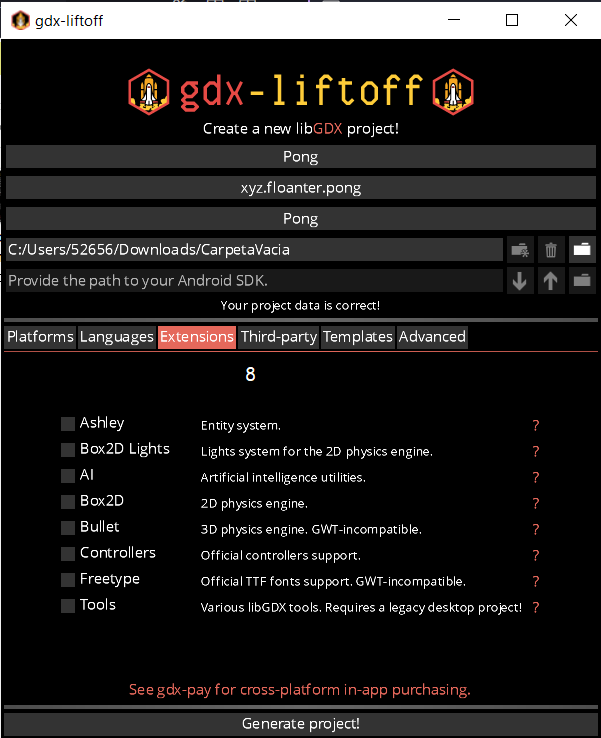
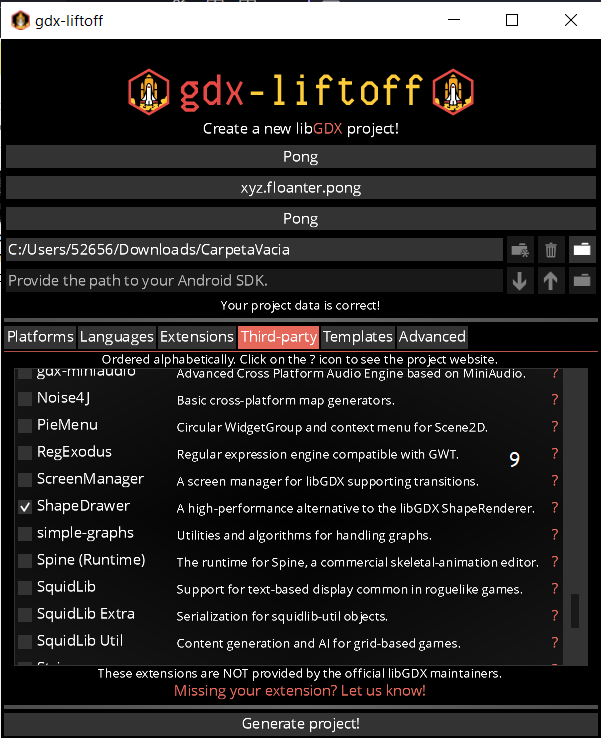
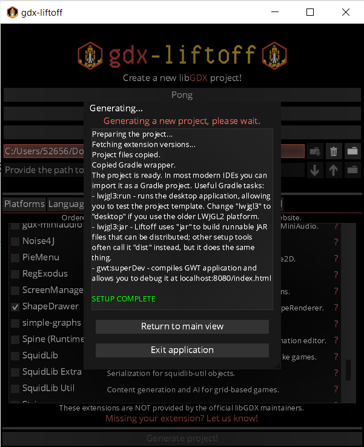
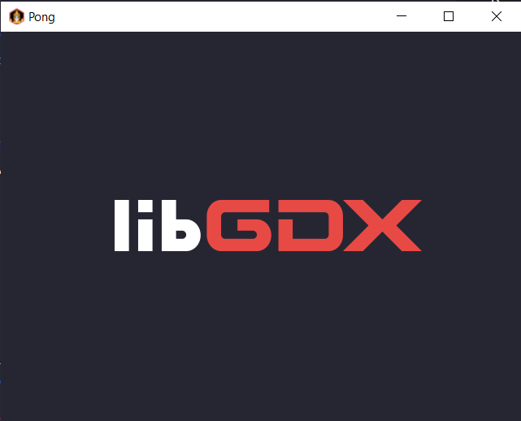

# Como crear un proyecto con Java y Libgdx.

Para aprender como crear un proyecto de Libgdx, no usaremos el generador oficial de Libgdx mas bien, usaremos Gdx-Liftoff que nos permitirá usar mas lenguajes y extensiones de terceros. Para este ejemplo crearemos el proyecto de "Pong" que será el juego del siguiente tutorial.

### Descargar OpenJDK

Para descargar e instalar openjdk simplemente los descargaremos de [Temurin](https://adoptium.net/es/temurin/).

Es importante activar las de: añadir al PATH, Asociar .jar y Establecer la variable JAVA_HOME.

### Descargar Gdx-Liftoff

Vamos al repositorio de [Gdx-liftoff](https://github.com/tommyettinger/gdx-liftoff/releases) y descargamos el archivo .zip y lo descomprimimos.

### Configurar proyecto

Abrimos Gdx-Liftoff y rellenamos las opciones:

1. Título del juego.
2. Dominio y nombre del juego (com.domino.nombredeljuego).
3. Nombre de la clase principal.
4. Carpeta vacía donde se genera el proyecto.
5. Dirección del SDK de Android (No es necesario si no se creara para android).
6. Plataformas para las que se crea el juego.

7. Usar otros lenguajes (no usar si se trabaja con Html y GWT).

8. Extensiones oficiales de Libgdx.

9. Extensiones de terceros (en este caso usaremos ShapeDrawer). 

### Generar proyecto

Damos click en "Generate project!" y esperamos a que termine y diga "SETUP COMPLETE" y listo.

### Probar proyecto
Vamos a los Tasks de Gradle > lwjgl3 > application > run.

### Compilar proyecto

Para generar un .jar para escritorio vamos a:
Tasks de Gradle > lwjgl3 > Tasks > build > jar.

Para compilar para HTML vamos a:
Tasks de Gradle > html > Tasks > other > dist.

### Despedida

Espero que te haya ayudado a crear tu proyecto de Ligdx de una manera fácil y entendible, si tienes alguna duda o sugerencia no dudes en comentar 😁

Bueno, me piro vampiro, ten un buen dia.