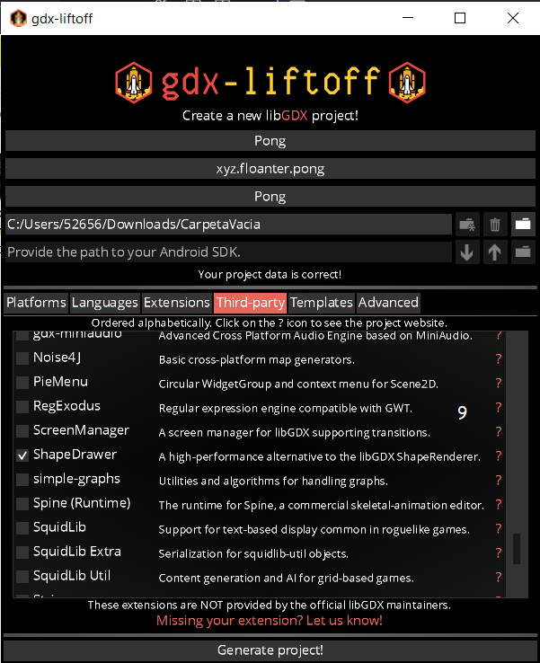

# How to create a project with Java and Libgdx.

To learn how to create a Libgdx project, we won't use the official Libgdx generator, rather, we'll use Gdx-Liftoff which will allow us to use more third-party languages and extensions. 

For this example, we will create the "Pong" project that will be the game for the next tutorial.

### Download OpenJDK

To download and install openjdk we simply download it from [Temurin](https://adoptium.net/es/temurin/).

It is important to activate the options: add to the PATH, associate .jar and set the JAVA_HOME variable.

### Download Gdx-Liftoff

Let's go to the repository [Gdx-liftoff](https://github.com/tommyettinger/gdx-liftoff/releases), we download the .zip file and unzip it.

### Configure Project

We open Gdx-Liftoff and fill in the options:

1. Game title.
2. Domain and game name (com.domino.gamename).
3. Name of the main class.
4. Empty folder where the project will be generated.
5. Android SDK address (Not required if not built for android.)
6. Platforms for which the game will be created.

7. Use other languages (do not use if you work with HTML and GWT).

8. Official Libgdx extensions.

9. Third party extensions (in this case we will use ShapeDrawer to draw geometric shapes). 

### Generate Project

We click on "Generate project!", We wait for it to finish and say "SETUP COMPLETE" and that's it.

### Test Project
Go to Gradle Tasks > lwjgl3 > application > run.

### Compile Project

To generate a .jar for desktop we are going to:

Gradle Tasks > lwjgl3 > Tasks > build > jar.

To compile for HTML we are going to:

Gradle Tasks > html > Tasks > other > dist.

### Farewell

I hope it has helped you to create your Ligdx project in an easy and understandable way, if you have any questions or suggestions do not hesitate to comment 😁

Well, see you later, have a good day.